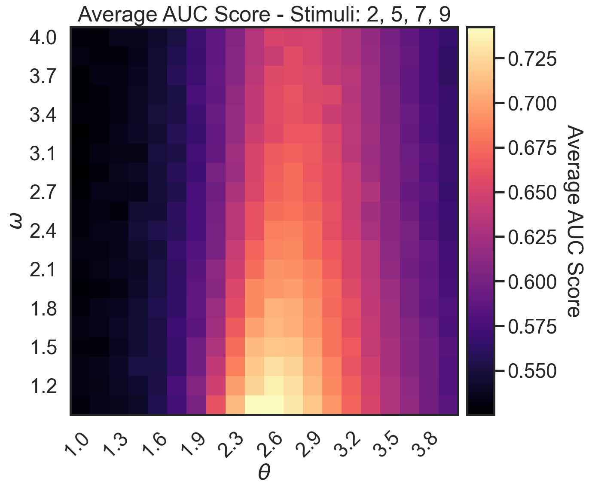

# LSTM-Perturbation Prediction for Cellular Automata Models

This repository provides the code for deep learning-based analysis (figure 3) presented in Gómez et al. (2023). 

> Gómez-Nava, L., Lange, R. T., Klamser, P. P., Lukas, J., Rodriguez, L. A., Bierbach, D., Krause, J., Sprekeler, H., Romanczuk, P. (2023), *Fish shoals resemble a stochastic excitable system driven by environmental perturbations.* Nature Physics.

<a href="docs/auc_criticality_rnn_v2.png"></a>

More specifically, we train recurrent neural networks (LSTMs) to detect cell perturbations (e.g. 'predactor attacks') in a local neighbourhood of the perturbation epicenter. For this we consider different cellular automata (CA) as mechanistic models of collective behavior. First, we generate a dataset for a specific CA parameterization consisting of cell activations and perturbation levels across time. The data is split into train and test set. Afterwards, we train the LSTM to detect the event of a perturbation based a sampled subset of cells (fixed for a rollout). Please get in touch with [Robert Lange](https://roberttlange.github.io/) or open an issue if you have any detailed questions.

## Installation

Create a clean virtual environment (e.g. using an Anaconda distribution) and install all required dependencies.

```
conda create -n critical python=3.8
source activate critical
pip install -r requirements.txt
```

In order to fully replicate all of the results you will have to train 300 RNNs for different CA settings and up to 5 random seeds. Running every single configuration sequentially will take a long time. We therefore outline how to train a single model first and then provide details on how to parallelize the training on a HPC using the [MLE-Infrastructure](https://github.com/mle-infrastructure).

## Training a Single RNN Model & ROC Analysis

Training three individual RNN on the data generated by a cellular automata corresponding to different criticality settings can be achieved as follows:

```
python train_perturb_rnn.py -config configs/local_critical.json  # coupling 2.7, 1.8 spontaneous
python train_perturb_rnn.py -config configs/local_super.json     # coupling 1.0, 1.8 spontaneous
python train_perturb_rnn.py -config configs/local_sub.json       # coupling 4.0, 1.8 spontaneous 
```

This will first generate a dataset of perturbed cellular automata sub-sampled patch sequences, which takes up approximately 30GB of memory. Afterwards, the RNNs will be trained to detect the event of an attack. The training is done using the PyTorch automatic differentiation library and is completed using 5 CPU cores (10 threads). The training of a single network should not take longer than 30 minutes. The results will be stored in a directory called `experiments/`.

Afterwards, the Signal Detection/ROC analysis for the trained RNNs can then be run as follows:

```
python gen_roc_analysis.py -config configs/local_critical.json -ckpt experiments/local_critical/models/final/final_seed_0.pt
python gen_roc_analysis.py -config configs/local_super.json -ckpt experiments/local_super/models/final/final_seed_0.pt
python gen_roc_analysis.py -config configs/local_sub.json -ckpt experiments/local_sub/models/final/final_seed_0.pt
```

This will generate ROC scores for different perturbation intensities.

## Distributed Training of all RNNs on a HPC

The grid sweep experiments over different parameters (coupling and spontaneous rate) are organized using the [MLE-Infrastructure](https://github.com/mle-infrastructure). It provides a framework for logging and scheduling experiments on either Slurm, OpenGridEngine or Google Cloud Platform.

```
pip install mle-toolbox[full]
```

After installing the requirements and if you have access to one of these resources, you can initialize/setup the toolbox using the CLI command `mle init`. After successful installation of the `mle-toolbox` package and the following cluster/GCP credential verification you should be able to replicate the main grid searches from the command line as follows:

```
mle run configs/hpc_perturb_a0_w0.yaml
```

The results will be stored in `experiments/local_grid`.